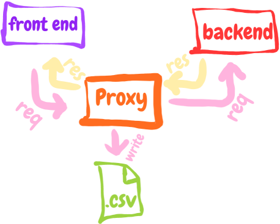

# logger-proxy



Do you know what a proxy is?¹

So that's right!

the only difference is that this will write the request information in a .csv file so you know what is being sent by your service that sucks debugging! :kissing_smiling_eyes:

¹ Do not know what a proxy is? read here: [how does http proxy work?](https://stackoverflow.com/a/9474489/3617036)

## Installation


```
git clone
yarn install
yarn start
```

## EnvVars

> .env variables loaded by default in project root.

| Env Variable | Description | Example |
|:---:|:---|:---|
|TARGET|where the proxy will send the requests must contain protocol, host and port (if not 80)|http://localhost:8082|
|FROM_PORT|port that the proxy will be listening |5000|
|FILE_PATCH|path that the log will be stored|./logs|
|FILE_NAME|prefix of the file name, all files are added by [filename + YYMMDDhhmm]|log|

## Example

Imagine that you want to capture all the requests that your backend receives from your frontend layer.

usually you will have your applications structured like this:


**FRONT_END**
- PORT=3000
- API_HOST=http: // localhost: 8082 / api


**BACK_END**
- PORT=8082

Whereas you would like to capture requests with the proxy:


**FRONT_END**
- PORT=3000
- API_HOST=http: // localhost: 5000 / api


**LOGGER_PROXY**
- TARGET=http: // localhost: 8082
- FROM_PORT=5000
- FILE_PATCH=./logs
- FILE_NAME=log
 

**BACK_END**
- PORT=8082

## Watch

- Dockerfiles are completely useless, since if you create a container, the whole infra will be inside a network, and map the ports every time is very annoying.

- the proxy only passes requests to http servers, if trying to send through https will not work. pull requests are welcome :two_hearts:
